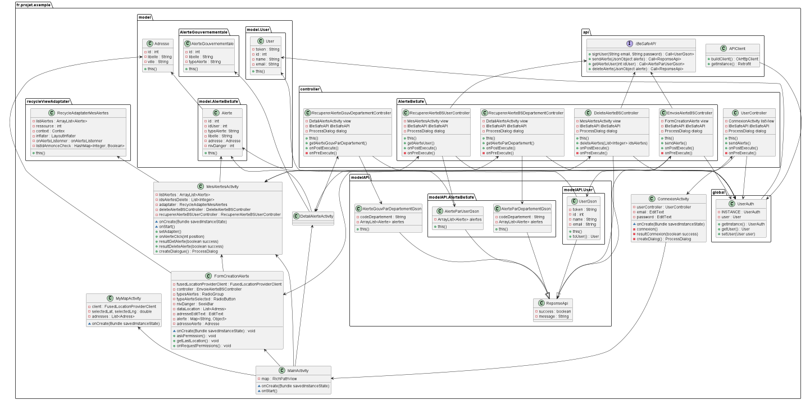

= Cahier de spécification

== Partie 1 : Synthèse

Application de prévention et de lutte contre les désagréments de rue quotidiens

Abréviation : BeSafe

Membres : Amine Chebah, Amin Hasnaoui, Nejma Smatti

=== Présentation :

Notre application a pour but de pallier un problème qui n’est pas nouveau mais qui est
néanmoins persistant. De nos jours, sortir seul (ou pas) le soir (ou pas) peut être source
d’anxiété. De nombreux témoignages le démontrent et il n’existe pas encore de moyen
efficace pour remédier à cela. Avec l’application Be Safe, nos utilisateurs pourront entre
autres demander et bénéficier de l’aide des personnes à proximité et profiter des
nombreuses fonctionnalités de l’application afin de rendre leur quotidien plus « safe ».

Notre application a pour ambition de répondre à une problématique réelle et de fournir un
support efficace où un besoin se fait ressentir pour un public très large depuis déjà bien
longtemps.

Étant jeunes, et non véhiculés, et habitant en région parisienne, nous sommes les
principales personnes visées comme cible de cette application.

Nous avons pu observer qu’il existait quelques applications qui pouvaient coïncider avec
quelques points que nous avons décidé de développer, cependant, ces applications ne
fournissent pas un service de qualité soit à cause de l'arrêt de leur développement ou alors
par la pauvreté des services proposés.

==== Contexte :

Sara : L’application BeSafe est un outil innovant et précieux pour Sara.

Bénéfice : Avoir une application pour accroître le sentiment de sécurité lors de ses
déplacements.

* Sara est inquiète lorsqu'elle doit se déplacer seule à des heures tardives à pied
Bénéfice : Pouvoir se rassurer et rassurer son entourage quant à ses déplacements
* Sara reçoit une assistance de l’application
Bénéfice : Gestion plus facile de l’application
* Sara souhaite une carte dans l’application pour visualiser, pinger les gens et
comme dans maps, avoir le meilleur trajet
Bénéfice : faciliter l’utilisation de l’application
* Sara souhaite recevoir des indicateurs de zones sensibles avec des informations
sur les horaires et les fréquentations par zones
Bénéfice : faciliter l’utilisation de l’application
* Sara souhaite avoir une assistance si elle est blessée
Bénéfice : avoir une première assistance avant l’arrivée des secours
* Sara veut aider des personnes en danger
Bénéfice : rendre les rues plus sûres pour elle et les autres utilisateurs
* Sara veut recevoir des alertes des personnes en danger à proximité avec leur
localisation exacte si elle accepte l’alerte
Bénéfice : aider les personnes en danger
* Sara veut visualiser sur la carte le personnel qualifié pour lui venir en aide
Bénéfice : assistance développée pour les urgences avérés (si elle se fait vraiment
agresser)
* Sara souhaite une fonctionnalité pour organiser des trajets entre utilisateurs
Bénéfice : entraide accrue
* Sara souhaite que les urgences soient appelées si un incident grave est déclaré
Bénéfice : faciliter l’utilisation de l’application
* Sara peut bénéficier, si elle souhaite, de conseils/formations en ligne sur les premiers
gestes à avoir en cas de problème
Bénéfice : Apporter une aide de qualité aux personnes en danger

==== Buts & comportements

* Dans le menu carte
Sara voit en temps réel la son trajet généré avec les informations recueillies au
préalable
* Dans le menu carte
Sara peut saisir son trajet
* Dans le menu tableau de bord > déclarer un incident
Sara déclare un incident
* Dans le menu tableau de bord > organiser un trajet
Sara peut organiser un trajet pour se rendre à une destination accompagnée de
personnes se rendant à proximité
* Dans le menu tableau de bord > feedback
Sara partage son ressenti sur l’application
* Dans le menu tableau de bord > secours
Sara peut appeler les secours
* Dans le menu carte
Sara peut visualiser les zones à risque
* Dans le menu carte
Sara veut avoir une liste de professionnels ayant l’application
Prévisions marketing
Distribution de flyers devant de soirées / WEI / campus étudiants
* Pub sur les réseaux sociaux
* Pub lors d'événement “jeunes”

== PARTIE 2 : aspects techniques
* Application Mobile
* schéma architectural de l'application :

.schéma architectural
image::Schema-MVC.jpg[width=500]

* plateforme technologique (langages utilisés, frameworks de test, de lien métier/API,
métier/persistance) xml/ java / MySQL
* plateforme opérationnelle (gestion de versions, build, qualité de code, CI,
déploiement) GitHub/Gradle/Sonar/CircleCi

== PARTIE 3 : modélisation

* maquette du front correspondant à la feature (une ou plusieurs représentation
d'interface, avec la description des enchaînements)
 ** feature affichage alerte
 on y voit afficher les différentes alertes en fonctions des arrondissements de Paris

.feature 1
image::mock-up_Be-Safe.png[width=400]

** feature alerte géolocalisée

.Feature 2
image::mock-up-alerte.png[width=400]

**

* diagramme de classes global (partie métier)

.digramme de classes global

* description API back (ex REST)
* diagrammes de séquence des interactions front/back (par feature, voir le back
comme une boîte noire)

.digramme back
image::DiagrammeBACK.png[width=600]